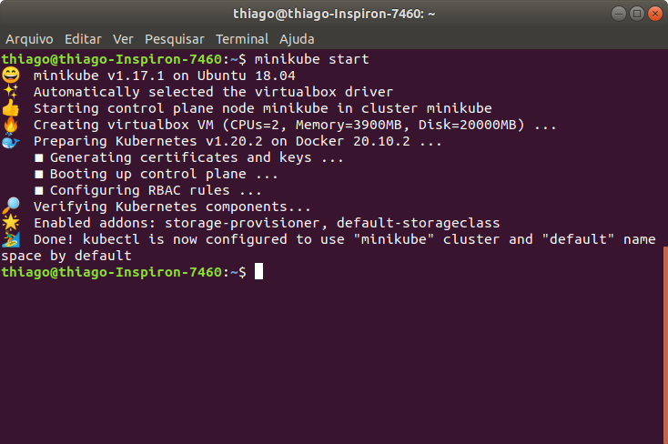
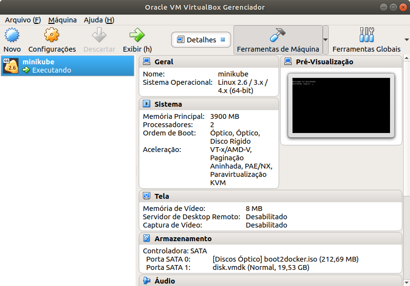
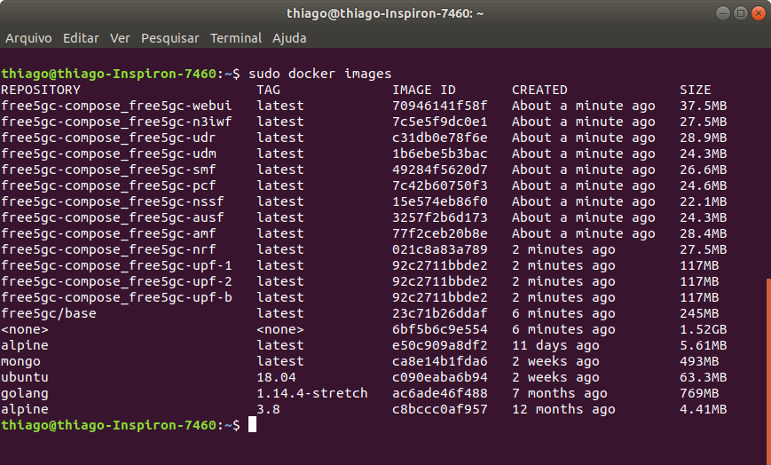
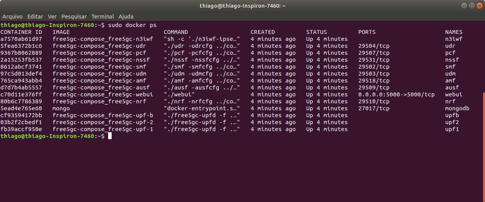
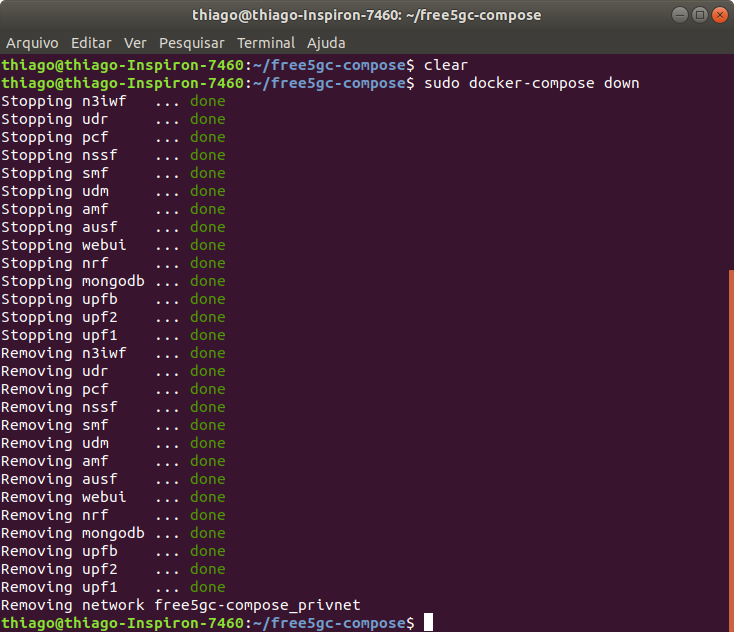
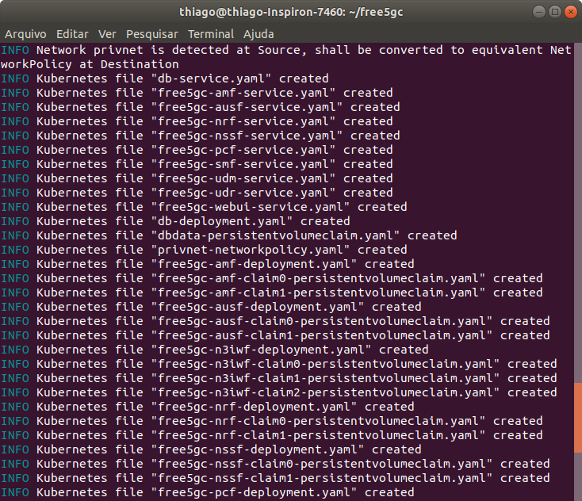
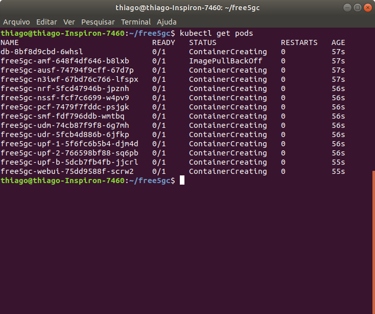
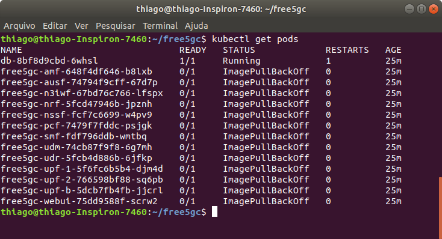

# Orchestration Architecture for The 5G Core


## 1. Descrição do Projeto

Este projeto versa sobre a preparação de um ambiente local para execução do núcleo 5G de forma orquestrada através do Kubernetes. Com o objetivo de instanciar nossa infraestrutura localmente utilizaremos o Minikube que permite a criação de um cluster Kubernetes no seu host local.

Como base foi utilizado o [Free5GC Compose](https://github.com/free5gc/free5gc-compose#docker-engine)

<p align="center">🚧 Em construção... 🚧</p>


## 2. Sumário

   * [1. Descrição do Projeto]
   * [2. Sumário]
   * [3. Instalação do Kubernetes e Minikube]
      * [3.1 Preparando o Sistema]
      * [3.2 Instalação do Minikube]
      * [3.3 Instalação do Kubectl]
      * [3.4 Iniciando o Cluster]
      * [3.5 Operando o Minikube]
   * [4. 5G Core]
      * [4.1 Prerequisitos]
      * [4.2 Iniciando o Free5gc]
   * [5. Traduzindo os arquivos do Docker Compose para Kubernetes]
      * [5.1 Instalando o Kompose]
      * [5.2 Docker Compose to Kubernetes]
   * [6. Subindo nosso Cluster (ERRO!)]

## 3. Instalação do Kubernetes e Minikube


> Para este guia foi utilizado as configurações de Hardware e Software listadas a seguir que servem apenas como registro da ambientação. Não significa portanto que que este guia não possa ser aplicado num ambiente com características físicas diferentes. As ferramentas descritas podem ser executadas no Windows, Linux e Mac.:
>
> - Notebook Dell Inspiron 7460
>   - Processador: Intel i5 7th Gen
>   - Memória 16 GB DDR 4
>   - HD: 320 GB SSD
> - Ubuntu 18.04
>   - Kernel Versão 5.4.0
>   - VirtualBox Versão 5.2

Para instalação do Kubernetes e Minikube recomendo o material oficial do [Kubernetes ](https://kubernetes.io/docs/tasks/tools/) que disponibiliza material de instalação para todas as plataformas.

### 3.1 Preparando o Sistema

Inicialmente vamos atualizar o sistema

```bash
sudo apt-get update -y
```

```bash
sudo apt-get upgrade -y
```

Também iremos instalar os seguintes pacotes:

```bash
sudo apt-get install curl
```

```bash
sudo apt-get install apt-transport-https
```

Instalando o gestor de máquinas virtuais

```bash
sudo apt-get install virtualbox virtualbox-ext-pack
```


> Observação: Foi utilizado o VirtualBox versão 5.2 em detrimento da versão 6.1. Ao utilizar a versão 6.1 erros foram apresentados e puderam ser inicialmente corrigidos utilizando a versão 5.2 do software.

### 3.2 Instalação do Minikube

> O minikube é uma ferramenta que permite a execução do kubernetes em um computador local. Essa ferramenta irá criar um cluster kubernetes localmente através de uma VM.

**Requisitos Mínimos**

Para instalação do minikube você irá minimamente precisar de:

- 2 Núcleos de CPU's ou mais
- 2GB de memória disponível
- 20GB de espaço em disco
- Conexão com a internet
- Gerenciador de máquina Virtual (ex.: VirtualBolx, VMWare)

1. Download dos binários:

```bash
curl -LO https://storage.googleapis.com/minikube/releases/latest/minikube_latest_amd64.deb
```

```shell
sudo dpkg -i minikube_latest_amd64.deb
```

2. Verificando se está tudo ok:

```bash
minikube version
```


### 3.3 Instalação do Kubectl

> O kubectl é necessário para efetuar os deploys e gerenciar o kluster.


1. Download do Kubectl

```bash
curl -LO "https://dl.k8s.io/release/$(curl -L -s https://dl.k8s.io/release/stable.txt)/bin/linux/amd64/kubectl"
```

2. Instalando o Kubectl

```bash
sudo install -o root -g root -m 0755 kubectl /usr/local/bin/kubectl
```

3. Verificando se está tudo ok:

```bash
kubectl version --client
```


### 3.4 Iniciando o Cluster

Para iniciar nosso cluster basta inserir o comando:

```
minikube start
```

Com este comando o minikube irá fazer o download dos binários necessários, criar uma VM no VirtualBox e preparar nosso Cluster. Caso tudo ocorra bem serão carregadas as seguintes informações:



Figura 1: Minikube Start

No Virtualbox será criada uma nova máquina virtual chamada Minikube. Como não passamos nenhum parâmetro através do comando `minikube start` o cluster foi criado com as seguintes configurações:

- Memória 4GB
- Armazenamento 20GB
- 2 CPU's

Caso seja necessário iniciar o minicube com configuraçẽos diferentes basta informar através de parâmetros. Suponhamos a necessidade de criar um cluster com 40GB de armazenamento 2GB de memória e 4CPU's poderiamos utilizar o comando da seguinte maneira:

```bash
minikube start --disk-size=40g --cpus 4 --memory 2048
```

Entretanto sugiro manter as configurações padrão executando o comando sem passar nenhum parâmetro. Ao fim teremos o seguinte resultado em nosso Virtual Box:



Figura 2: Minikube Vbox


### 3.5 Operando o Minikube

A seguir uma lista de parâmetros a serem utilizados no minikube:

```bash
minikube start
```

Inicia o cluster

```bash
minikube start --disk-size=40g --cpus 4 --memory 2048
```

Inicia o cluster com parâmetros específicos:

- --disk-size = Tamanho do disco
- --cpus = Quantidade de cpus
- --memory = Quantidade de memória disponível

```bash
minikue dashboard
```

Abre uma interface web com informações sobre seu cluster

```bash
minikube pause
```

Pausa o funcionamento do kubernetes

```bash
minikube stop
```

Finaliza a execução do cluster

```bash
minikube config set memory 8192
```

Define tamanho máximo de utilização de memória pelo cluster. É necessário reinicialização para que surta efeito.

```bash
minikube delete
```

Exclui o cluster.


## 4. 5G Core 

Nessa sessão iremos realizar o download dos pacotes necessários para instanciar o núcleo do 5g.

Iremos utilizar os arquivos originados do repositório Free5GC Composebaseado no projeto free5GC. O free5GC é um projeto de código aberto para redes de núcleo móvel de 5ª geração (5G).

### 4.1 Prerequisitos

**Passo 1: GTP5G Kernel module**

Por conta de exigências do UPF faz necessário a utilização do kernle 5.0 ou superior e a existência do módulo gtp5g. Faremos sua instalação:

```bash
git clone https://github.com/PrinzOwO/gtp5g.git
cd gtp5g
make
sudo make install
```

**Passo 2: Docker**

Instalação do docker para execução dos containers.

Instalação de pacotes pré-requisitos:

```bash
sudo apt install apt-transport-https ca-certificates curl software-properties-common
```

Adição da chave para o repositório oficial

```bash
curl -fsSL https://download.docker.com/linux/ubuntu/gpg | sudo apt-key add -
```

Adição do repositório do Docker

```bash
sudo add-apt-repository "deb [arch=amd64] https://download.docker.com/linux/ubuntu focal stable"
```

Atualização do banco de dados de pacotes

```bash
sudo apt update
```

Instalando o docker

```bash
sudo apt install docker-ce
```

Para verificar o status do Docker

```bash
sudo systemctl status docker
```


**Passo 3: Docker Compose**

O docker compose permite gerir a inicialização e finalização de diversos containers simultaneamente. Seu funcionamento se dá através de arquivos YAML que guardam as definições dos containers.

Baixando a release `1.28.2` do binário de instalação e salvar em `/usr/local/bin/docker-compose`, que tornará este software globalmente acessível como `docker-compose`

```bash
sudo curl -L "https://github.com/docker/compose/releases/download/1.28.2/docker-compose-$(uname -s)-$(uname -m)" -o /usr/local/bin/docker-compose
```

Definição das permissões para execução

```bash
sudo chmod +x /usr/local/bin/docker-compose
```

Para verificar se tudo ocorreu bem execute

```bash
docker-compose --version
```


### 4.2 Iniciando o Free5gc

Como precisando criar uma interface de tunel, necessitamos criar um containger com permissões de root.

Download dos arquivos do núcleo:

```bash
git clone https://github.com/free5gc/free5gc-compose.git
```

Compilando os arquivos

```bash
cd free5gc-compose
sudo make base
```

Construção dos serviços

```bash
docker-compose build
```

Executando os containers através do docker-compose

```bash
sudo docker-compose up 
sudo docker-compose up -d # Para execução em segundo plano
```

Para verificar as imagens disponíveis em nosso containers execute (abra outro terminal caso não tenha utilizado o parâmetro -d)

```bash
sudo docker images
```

Você deve se deparar com um retorno semelhante ao a seguir



Figura 3: Funções do Free5GC sendo executadas através de containers

Também podemso consultar o satus dos nossos containers com o comando:

```bash
sudo docker ps
```

A seguir temos o retorno



Figura 4: Status das funções

Para parar a execução dos containers:

```bash
sudo docker-compose down
```



Figura 5: Finalizando a execução dos containers


## 5. Traduzindo os arquivos do Docker Compose para Kubernetes

O kubernetes não permite a execução direta de um container no cluster. É necessário que se crie um pod para entao dentro desse pod configurarmos nossos containers.

O kubernetes possui uma ferramenta chamada ***Kompose*** que permite a conversão dos arquivos dos containers escritos em YAML pelo docker compose. Esse processo permite que o kubernetes orquestre apropriadamente os containers.


### 5.1 Instalando o Kompose

Download do binário:

```bash
curl -L https://github.com/kubernetes/kompose/releases/download/v1.22.0/kompose-linux-amd64 -o kompose
```

Definição das permissões para execução:

```bash
chmod +x kompose
```

Movendo o kompose para o diretório apropriado:

```bash
sudo mv ./kompose /usr/local/bin/kompose
```


### 5.2 Docker Compose to Kubernetes

Convertendo os arquivos do compose para o kubernetes. Primeiro iremos acessar o arquivo `docker-compose.yaml` e na primeira linha em `version: '3.8'` alterar para `3.0`. Logo após executar:

```bash
kompose convert
```

Ao executar o comando serão criados vários arquivos com extensão .yaml



Figura 6: Compose to Kompose

Após a conversão, vários arquivos com a extensão .yaml serão criados. O próximo passo consiste na criação dos recursos no nosso cluster através do comando `kubectl apply`.

```bash
kubectl apply -f .
```

Após executar o comando `apply` vamos listar os pods do cluster:

```bash
kubectl get pods
```

O retorno deve ser algo semelhante a tela a seguir:

 


Para remover os pods, deploymets e services utilize:

kubectl delete --all pods

kubectl delete --all deployments

kubectl delete --all services

## 6. Subindo nosso Cluster (ERRO!)


Chegamos ao ultimo tópico do post. O próximo passo é iniciar o cluster e verificar se as imagens foram adicionadas corretamente e estão em funcionamento. Para isso executaremos o comando:

```
minikube start
```

E após a inicialização do cluster iremos verificar os nossos containers com:

```
kubectl get pods
```

Temos o seguinte retorno:




Ao observar a imagem podemos perceber que os containters foram criados porém  o status de cada um está caracterizado como: **ImagePullBackOff** invés de **Running**.

Apresento a seguir:

a. Definição do problema

b. Possíveis causas

c. Próximo passo a ser efetuado


**a) Definição do problema**

ImagePullBackOff pode sinalizar alguns problemas dentro do cluster acredita-se que neste caso em específico as imagens dos containers não poderam ser baixadas e/ou extraidas.

**b) Possíveis causas**

1. A tag da imagem está incorreta. Essa falha pode ser derivada de erro de digitação ou configuração incorreta nos arquivos.
2. A imagem do containger não existe ou está em um registro diferente. Por padrão, o kubernetes usa o registro do Dockerhub para download das imagens. Entretanto é possível utilizar outros registros de repositórios como Quay.io, AWS ou Google Containger.
Para esse ponto foi observado que nos arquivos de configuração os registros apontam para utilização do Alphine Linux, distribuição que é encontrada no Docker Hub
3. O kubernetes não tem permissão para extrair a imagem.

**c) Próximos passos**

Serão tomados dois passos iniciais para a correção do problema:

O primeiro consiste na verificação dos arquivos de configuração criados pelo **konsole**. Ao verificar o manual de referência da ferramenta é possível ser necessário fazer adequações ao arquivo gerado.

Caso o primeiro passo não retorne êxito o segundo passo consiste em verificar os repositórios das imagens dos containers.


### Autor

---

<a href="https://github.com/thiagogmta"></a>

<a href="https://github.com/thiagogmta"><sub><b>Thiago Guimarães Tavares</b></sub></a>

[](mailto:thiagogmta@gmail.com)